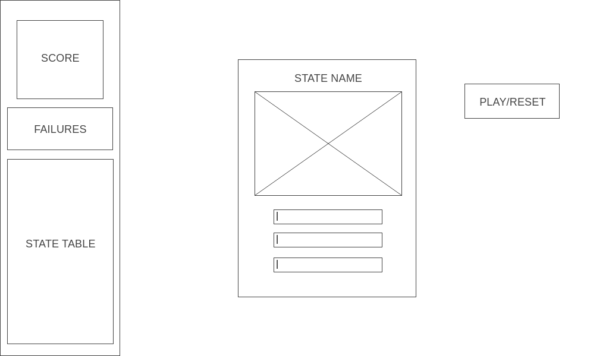

# Border Check

## Purpose

I've always struggled to visualize the layout of the states in realtion to each other. For the floundering geography student in me, and all others how hope to hone their geospatial craft, Border Check is here to help.

## User Stories

- AAU I want to be able to start the game with a play button
- AAU I want my inputs to provide feedback whether true or failures
- AAU I want to be able to see my current score, number of failures, and states completed
- AAU I want to be able to reset the game at any point after play with a reset button

## Wireframes

## Stretch Goals

1) Add instructions section
2) Make mobile responsive
3) Add variable difficulty
4) Add Hints

## Data Structure

statesObj = {
    AL: {
        name: 'ALABAMA',
        id: '1',
        bStates: [ 'FLORIDA', 'GEORGIA', 'MISSISSIPPI', 'TENNESSEE' ],
        imgFile: '',
    },
    AZ: {  
        name: 'ARIZONA',
        id: '2',
        bStates: [ 'CALIFORNIA', 'COLORADO', 'NEVADA', 'NEW MEXICO ', 'UTAH' ],
        imgFile: '',
    },
    AR: {
        name: 'ARKANSAS',
        id: '3',
        bStates: [ 'OKLAHOMA', 'TENNESSEE', 'TEXAS', 'LOUISIANA', 'MISSISSIPPI', 'MISSOURI' ],
        imgFile: '',
    },
    CA: {
        name: 'CALIFORNIA',
        id: '4',
        bStates: [ 'ARIZONA', 'NEVADA', 'OREGON' ],
        imgFile: '',
    },
    CO: {
        name: 'COLORADO',
        id: '5',
        bStates: [ 'ARIZONA', 'NEW MEXICO', 'OKLAHOMA', 'UTAH', 'WYOMING', 'KANSAS', 'NEBRASKA'],
        imgFile: '',
    },
    CT: {
        name: 'CONNECTICUT',
        id: '6',
        bStates: [ 'NEW YORK', 'RHODE ISLAND', 'MASSACHUSETTS' ],
        imgFile: '',
    },
    DE: {
        name: 'DELAWARE',
        id: '7',
        bStates: [ 'NEW JERSEY', 'PENNSYLVANNIA', 'MARYLAND' ],
        imgFile: '',
    },
    FL: {
        name: 'FLORIDA',
        id: '8',
        bStates: [ 'GEORGIA', 'ALABAMA'],
        imgFile: '',
    },
    GA: {
        name: 'GEORGIA',
        id: '9',
        bStates: [ 'NORTH CAROLINA', 'SOUTH CAROLINA', 'TENNESSEE', 'ALABAMA', 'FLORIDA'],
        imgFile: '',
    },
    ID: {
        name: 'IDAHO',
        id: '10',
        bStates: [ 'UTAH', 'WASHINGTON', 'WYOMING', 'MONTANA', 'NEVADA', 'OREGON'],
        imgFile: '',
    },
    IL: {
        name: 'ILLINOIS',
        id: '11',
        bStates: [ 'KENTUCKY', 'MISSOURI', 'WISCONSIN', 'INDIANA', 'IOWA', 'MICHIGAN'],
        imgFile: '',
    },
    IN: {
        name: 'INDIANA',
        id: '12',
        bStates: [ 'MICHIGAN', 'OHIO', 'ILLINOIS', 'KENTUCKY', 'IOWA'],
        imgFile: '',
    },
    IA: {
        name: 'IOWA',
        id: '13',
        bStates: [ 'NEBRASKA', 'SOUTH DAKOTA', 'WISCONSIN', 'ILLINOIS', 'MINNESOTA', 'MISSOURI'],
        imgFile: '',
    },
    KS: {
        name: 'KANSAS',
        id: '14',
        bStates: [ 'NEBRASKA', 'OKLAHOMA', 'COLORADO', 'MISSOURI'],
        imgFile: '',
    },
    KY: {
        name: 'KENTUCKY',
        id: '15',
        bStates: [ 'TENNESSEE', 'VIRGINIA', 'WEST VIRGINIA', 'ILLINOIS', 'INDIANA', 'MISSOURI', 'OHIO'],
        imgFile: '',
    },
    LA: {
        name: 'LOUISIANA',
        id: '16',
        bStates: [ 'TEXAS', 'ARKANSAS', 'MISSISSIPPI'],
        imgFile: '',
    },
    ME: {
        name: 'MAINE',
        id: '17',
        bStates: [ 'NEW HAMPSHIRE'],
        imgFile: '',
    },
    MD: {
        name: 'MARYLAND',
        id: '18',
        bStates: [ 'VIRGNIA', 'WEST VIRGINIA', 'DELAWARE', 'PENNSYLVANNIA'],
        imgFile: '',
    },
    MA: {
        name: 'MASSACHUSETTS',
        id: '19',
        bStates: [ 'NEW YORK', 'RHODE ISLAND', 'VERMONT', 'CONNECTICUT', 'NEW HAMPSHIRE'],
        imgFile: '',
    },
    MI: {
        name: 'MICHIGAN',
        id: '20',
        bStates: [ 'OHIO', 'WISCONSIN', 'ILLINOIS', 'INDIANA'],
        imgFile: '',
    },
    MN: {
        name: 'MINNESOTA',
        id: '21',
        bStates: [ 'NORTH DAKOTA', 'SOUTH DAKOTA', 'WISCONSIN', 'IOWA'],
        imgFile: '',
    },
    MS: {
        name: 'MISSISSIPPI',
        id: '22',
        bStates: [ 'LOUISIANA', 'TENNESSEE', 'ALABAMA', 'ARKANSAS'],
        imgFile: '',
    },
    MO: {
        name: 'MISSOURI',
        id: '23',
        bStates: [ 'NEBRASKA', 'OKLAHOMA', 'TENNESSEE', 'ARKANSAS', 'ILLINOIS', 'IOWA', 'KANSAS', 'KENTUCKY'],
        imgFile: '',
    },
    MT: {
        name: 'MONTANA',
        id: '24',
        bStates: [ 'SOUTH DAKOTA', 'WYOMONG', 'IDAHO', 'NORTH DAKOTA'],
        imgFile: '',
    },
    NE: {
        name: 'NEBRASKA',
        id: '25',
        bStates: [ 'MISSOURI', 'SOUTH DAKOTA', 'WYOMING', 'COLORADO', 'IOWA', 'KANSAS'],
        imgFile: '',
    },
    NV: {
        name: 'NEVADA',
        id: '26',
        bStates: [ 'IDAHO', 'OREGON', 'UTAH', 'ARIZONA', 'CALIFORNIA'],
        imgFile: '',
    },
    NH: {
        name: 'NEW HAMPSHIRE',
        id: '27',
        bStates: [ 'VERMONT', 'MASSACHUSETTS', 'MAINE'],
        imgFile: '',
    },
    NJ: {
        name: 'NEW JERSEY',
        id: '28',
        bStates: [ 'PENNSYLVANIA', 'DELAWARE', 'NEW YORK'],
        imgFile: '',
    },
    NM: {
        name: 'NEW MEXICO',
        id: '29',
        bStates: [ 'OKLAHOMA', 'TEXAS', 'UTAH', 'ARIZONA', 'COLORADO'],
        imgFile: '',
    },
    NY: {
        name: 'NEW YORK',
        id: '30',
        bStates: [ 'PENNSYLVANIA', 'VERMONT', 'CONNECTICUT', 'MASSACHUSETTS', 'NEW JERSEY'],
        imgFile: '',
    },
    NC: {
        name: 'NORTH CAROLINA',
        id: '31',
        bStates: [ 'TENNESSEE', 'VIRGINIA', 'GEORGIA', 'SOUTH CAROLINA'],
        imgFile: '',
    },
    ND: {
        name: 'NORTH DAKOTA',
        id: '32',
        bStates: [ 'SOUTH DAKOTA', 'MINNESOTA', 'MONTANA'],
        imgFile: '',
    },
    OH: {
        name: 'OHIO',
        id: '33',
        bStates: [ 'MICHIGAN', 'PENNSYLVANIA', 'WEST VIRGINIA', 'INDIANA', 'KENTUCKY'],
        imgFile: '',
    },
    OK: {
        name: 'OKLAHOMA',
        id: '34',
        bStates: [ 'MISSOURI', 'NEW MEXICO', 'TEXAS', 'ARKANSAS', 'COLORADO', 'KANSAS'],
        imgFile: '',
    },
    OR: {
        name: 'OREGON',
        id: '35',
        bStates: [ 'NEVADA', 'WASHINGTON', 'CALIFORNIA', 'IDAHO'],
        imgFile: '',
    },
    PA: {
        name: 'PENNSYLVANIA',
        id: '36',
        bStates: [ 'NEW YORK', 'OHIO', 'WEST VIRGINIA', 'DELAWARE', 'MARYLAND', 'NEW JERSEY'],
        imgFile: '',
    },
    RI: {
        name: 'RHODE ISLAND',
        id: '37',
        bStates: [ 'MASSACHUSETTS', 'CONNECTICUT'],
        imgFile: '',
    },
    SC: {
        name: 'SOUTH CAROLINA',
        id: '38',
        bStates: [ 'NORTH CAROLINA', 'GEORGIA'],
        imgFile: '',
    },
    SD: {
        name: 'SOUTH DAKPTA',
        id: '39',
        bStates: [ 'NEBRASKA', 'NORTH DAKOTA', 'WYONMING', 'IOWA', 'MINNESOTA', 'MONTANA'],
        imgFile: '',
    },
    TN: {
        name: 'TENNESSEE',
        id: '40',
        bStates: [ 'MISSISSIPPI', 'MISSOURI', 'NORTH CAROLINA', 'VIRGINIA', 'ALABAMA', 'ARKANSAS', 'GEORGIA', 'KENTUCKY'],
        imgFile: '',
    },
    TX: {
        name: 'TEXAS',
        id: '41',
        bStates: [ 'NEW MEXICO', 'OKLAHOMA', 'ARKANSAS', 'LOUISIANA'],
        imgFile: '',
    },
    UT: {
        name: 'UTAH',
        id: '42',
        bStates: [ 'NEVADA', 'NEW MEXICO', 'WYOMING', 'ARIZONA', 'COLORADO', 'IDAHO'],
        imgFile: '',
    },
    VT: {
        name: 'VERMONT',
        id: '43',
        bStates: [ 'NEW HAMPSHIRE', 'NEW YORK', 'MASSACHUSETTS'],
        imgFile: '',
    },
    VA: {
        name: 'VIRGINIA',
        id: '44',
        bStates: [ 'NORTH CAROLINA', 'TENNESSEE', 'WEST VIRGINIA', 'KENTUCKY', 'MARYLAND'],
        imgFile: '',
    },
    WA: {
        name: 'WASHINGTON',
        id: '45',
        bStates: [ 'OREGON', 'IDAHO'],
        imgFile: '',
    },
    WV: {
        name: 'WEST VIRGINIA',
        id: '46',
        bStates: [ 'PENNSYLVANIA', 'VIRGINIA', 'KENTUCKY', 'MARYLAND', 'OHIO'],
        imgFile: '',
    },
    WI: {
        name: 'WISCONSIN',
        id: '47',
        bStates: [ 'MICHIGAN', 'MINNESOTA', 'ILLINOIS', 'IOWA'],
        imgFile: '',
    },
    WY: {
        name: 'WYOMING',
        id: '48',
        bStates: [ 'NEBRASKA', 'SOUTH DAKOTA', 'UTAH', 'COLORADO', 'IDAHO', 'MONTANA'],
        imgFile: '',
    },
}; 

## Technologies Used

- HTML & CSS
- Javascript
- Bootstrap 4 
- Google Fonts