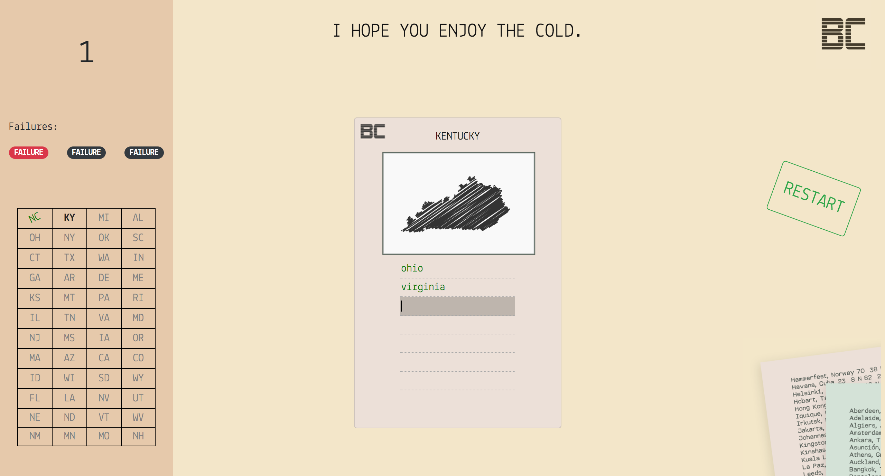
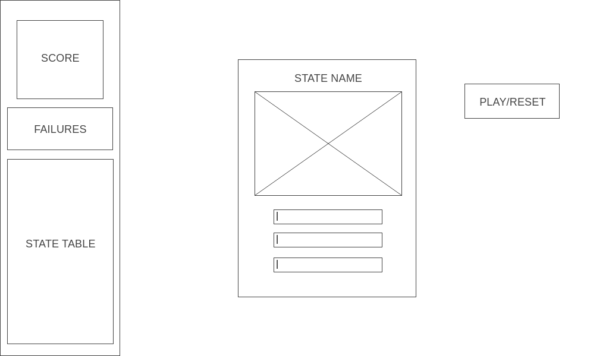

# Border Check

## Game

The year is 2124. After decades of sectarian violence, a tyrannical regime hell-bent on enforcing high standards
of geographical eduction has consolidated power. Under its rule citizens are subject to on-the-spot geography 
questionnaires known as "Border Checks." Those who resist become prisoners of the state, those who fail 
are never heard from again.
Rack your brain or be sent to the gulags in round after round of exhilerating Border Check!



[Border Check](https://graemebrooks.github.io/Border-Check/)

## Purpose

I've always struggled to visualize the layout of the states in relation to each other. For the floundering geography student in me, and all others who hope to hone their geospatial craft, Border Check is here to help.

## User Stories

- AAU I want to be able to start the game with a play button.
- AAU I want my inputs to provide feedback that notifies me if I have correctly or incorrectly guessed the bordering state.
- AAU I want to be able to see my current score, number of failures, and states completed.
- AAU I want to be able to reset the game at any point after play with a reset button.

## Wireframes



## Stretch Goals

1) Add instructions section
2) Make mobile responsive
3) Add variable messages for each state
4) Add Hints

## Data Structure

Data structure is an object defined as 'statesObj' that includes key value pairs with the following format:

```
{
    ...,
    TX: {
        name: 'TEXAS',
        id: '41',
        bStates: [ 'NEW MEXICO', 'OKLAHOMA', 'ARKANSAS', 'LOUISIANA'],
    },
    ...
}
```

## Technologies Used

- HTML & CSS
- Javascript
- Bootstrap 4 
- Animate.CSS library


## Asset Credits

- State vectors by [Free Vector Maps](https://freevectormaps.com)
- Sounds from [Freesound](https://freesound.org/)